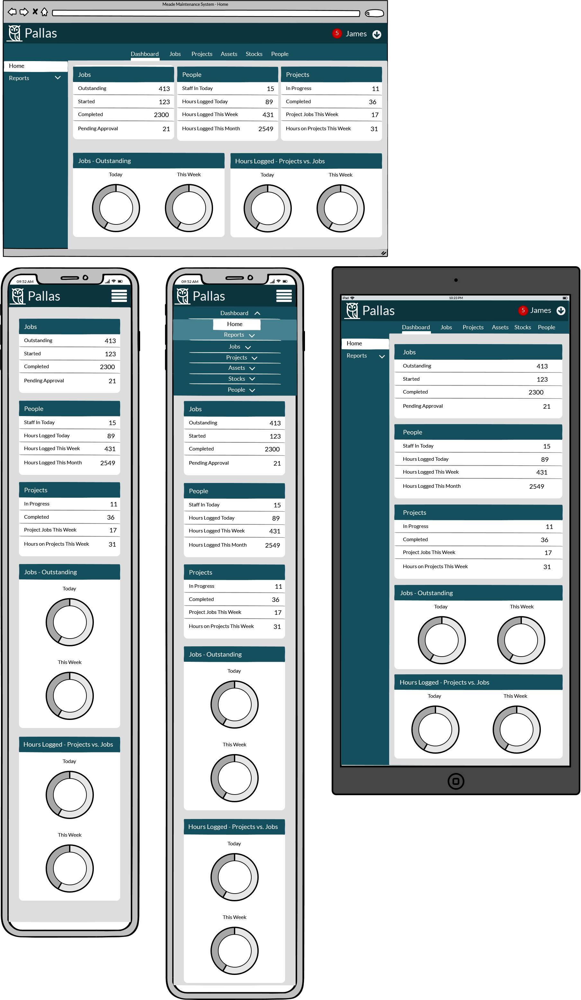
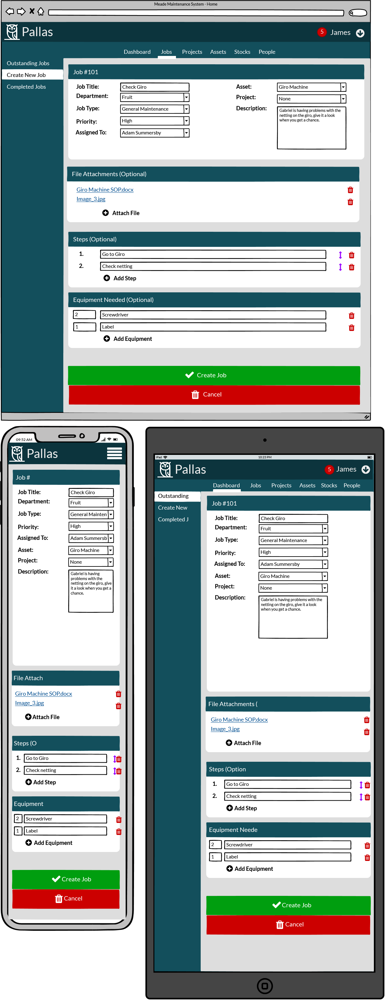

# Meade Maintenance App

## Contents

1. [Project Overview](#project-overview)
2. [Project Inception](#project-inception)
3. [UX](#ux)
4. [Features](#features)
5. [Technologies](#technologies)
6. [Testing](#testing)
7. [Running Locally](#running-locally)
8. [Deployment](#deployment)
9. [Project Outcome](#project-outcome)
10. [Credits](#credits)

## Project Overview

The Meade Maintenance App is a bespoke web based application, designed for Meade Farm Group, that allows the maintenance team and their managers to record and maintain stock records and job records. The project uses *Django*, *PostgresQL*, *Heroku* and *AWS S3*. The project was requested by the maintenance team who required an easy to use, mobile, responsive application for recording and maintaining stock and job records.

Meade Farm Group is a fresh goods processor based in the Republic of Ireland, servicing the retail food sector, supplying fresh goods to the likes of Lidl and Aldi, amongst others. The maintenance/engineering teams at the company are involved in the general maintenance of all the machines in the factory, utilities in the offices and developing new areas and projects. Due to this wide range of responsibilities and the often *ad-hoc* nature of their work an app was required that allowed the team to record and maintain records of their work quickly and easily while on the job as well as being intuitive, giving users notifications of outstanding jobs to be done.

Recording and maintaining stock records and job records and analayzing the trends and resources being used by different departments was key to management too to be able to make informed decisions.

## UX

### Project Goals

The goal of this project is to create an application that allows maintenance/engineering users to record and maintain job records as well as stock records. The interface should be quick and easy to use, bearing in mind that the users often will need to record information on the application while on the job. The stock system should allow stock to be received in, transferred to a user, and assigned to a job. It should also allow. All jobs and stock movements should be assigned to a department/product line so that reports can be build to analyze the resources being spent used by the different departments/product lines. The UI should be simple, easy to use and navigate, and feature unique functionalities depending on the user that is logged in *(Admin, Manager, General Operative, etc.)* The app should also communicate effectively with the users, informing them when they've been assigned a job/have outstanding tasks via notifications when on mobile.

### User Goals

* Record time against jobs
* Stock management
* Allocate resources to jobs
* View outstanding jobs
* View reports about resources being consumed
* Easy to use UI when working
* Notifications system that informs users of new jobs that have been assigned

### User Stories

* As a maintenance engineer, I need to be able to easily view my outstanding jobs while on the production floor. I also need to be able to quickly create and record time against jobs. I also need to be able to create unscheduled *ad hoc* jobs. I also want to be notified of any new jobs that are assigned to me.
* As a maintenance manager, I need to be able to create jobs and assign them to users. I also need jobs to be automatically generated for different assets at specified time intervals. I also need to be able to view reports detailing resources used by different departments/product lines. I also need to be able to see pending requests and approve them. I also want to be able to assign priorities to jobs.
* As a stock controller, I need to be able to accurately maintain stock records. I need to be able to receive stock in and then assign it to users who can then assign it to jobs. I'd also like to be notified when stock quantities fall below a certain threshold. I'd also like to be able to assign items barcodes and be able to scan those barcodes when assigning stock.
* As a production supervisor, I need to be able to request jobs by maintenance. I should be able to specify the area where the problem is, details of the problem and I should be notified whether the request has been accepted or not.
* As a commercial buyer, I need to be able to see reports detailing how much resources/time is being consumed by my product lines so that I can make informed decisions about the viability of the products.

### Site Owner Goals

* As a site owner, I want the mobile controls for users to be minimal, simple and easy to use for engineers trying to record jobs on the go.
* As a site owner, I need to have a robust permissions system to account for different user types who should have access to different sections.
* As a site owner, I need to build a robust relataional database structure that allows for easy expansion and changes.

### User Requirements and Expectations

#### Requirements

* Create and record time/resources against jobs
* Jobs page where they can see tasks that have been assigned to them
* Stock management system
* Allow assignment of stock/time resources to departments
* Notifications system to inform users of outstanding jobs that need to be done, new requests, stock alerts
* Manager console where managers can assign jobs, view crew status
* Reports where managers can view resources/time being consumed by different departments/product lines
* Asset management system where assets *(machines, equipment)* can be recorded and maintained
* Job request form that anyone in the company can fill in to request a job be done.
* Request approval system for managers.
* Barcoding system for parts
* Easy search functionality when searching for parts
* View asset history, maintenance job records
* PPM - Scheduling of PPMs for assets
* Projects system - Jobs Assigned to Project
* File uploads, pictures, pdfs, etc.

#### Expectations

* Consistent styling across site
* Easy to use, formal/professional UI

### Design Choices

Given the application's purpose, I needed the UI of the application to be simple, clear, easy to navigate and minimalistic so as not to distract a user trying to complete tasks on the app while working. I decided to use [Bootstrap v4.6](https://getbootstrap.com/docs/4.6/getting-started/introduction/) as a starting place given it's wide range of built-in functionality.

#### Colours

For colours, I wanted the site to be consistent across the site with a standard colour pallette to make user interactions clear and easy. I used [Coolors](https://coolors.co/) to help with that. I settled on a two blue shades for the navigation and header elements of the site, along with black and white white colours for the main fields and body elements as well as text.

#### Fonts

I wanted the fonts to be professional, clearly legible and formal. For this, I decided on Lato Regular 400 for the main element text and Roboto Bold 500 for the headings and navigation.

I used [Google Fonts](fonts.google.com) to source these fonts.

### Process Flow

TBD

### Wireframing

For wireframing, I used [Balsamiq](https://balsamiq.com/). I spent a lot of time thinking about and looking for inspiration for layout designs that would suit the application. Given the use of the app, I wanted the navigation to be easy to use, but at the same time there was a lot of functionality and forms that the user could need to get to so I needed that to work too.

I eventually decided on a dashboard layout where navigation headings would be at the top of the main elements and the sub navigation within that heading to the side.

#### Dashboard

The dashboard view is the view a user sees when they initially log into the app. It consists of a different stats and charts that display key metrics about the state of affairs regarding jobs, people and projects.

The top bar consists of the app name, and the user name where they can click to log out. It also has a notification icon which shows the user how many unread notifications they have.

Beneath that, on desktop the users can navigate to the different main sections of the site, the links appear differently depending on the user type *(Admin/Manager/Stock Person/General Operative)*

The side navigation, on desktop shows the sub navigations for that section. For the dashboard this means they can go to the home screen, the screen they are on or view reports about various things.

These navigation elements wrap on mobile views to a dropdown menu with the subheadings as a dropdown menu.

The main section of the site features the off white colour for the background of the site and the different elements for the section featured in tabs with the dark blue colour for the heading of the tab.

#### Jobs - Home

The Jobs - Home page shows the user their outstanding jobs in a table format with key details. They can click on the rows to view the job. There is also a search bar where the user can search for something in the table.

Some of the columns are removed on mobile views to fit screen width.

#### Job - Detail

The job detail views shows details of the job in the first tab as well as attachments, the steps needed to complete the job in the second tab, the parts that have been added to the job in the third tab. The equipment needed for the job in the fourth section and the time that has been logged for the job in the fifth section.

Beneath this are operations the user can perform for the job such as editing the details of the job, starting/stopping the job, logging time against the job, marking it complete, adding parts to the job or canceling the job.

#### Job - Create

The job create view allows the user to create a job. The top section allows the user to add the details for the job, the second section allows the user to attach files such as a user manual or picture to the job. The third section allows the user to add the steps required to complete the job, it also allows them to adjust the ordering of the steps to complete the job. The third section allows the user to specify the equipment needed to complete the job.

#### Notificaitons

The notifications view shows the user notifications in a table view as well as providing a link to whatever it is requires their attention.

#### Employee/Profile Page

The profile page allows users to view their profile with their employee details as well as their statistics.

If a manager is logged in, they can generate an employee report or use the *Give Bonus* button to award an employee a bonus.

#### More Wireframes

The rest of the wireframes follow a similar styling pattern and so I will not show them all here. You can view the rest of the wireframes [here](wireframes/Wireframes.pdf).

