# Pallas

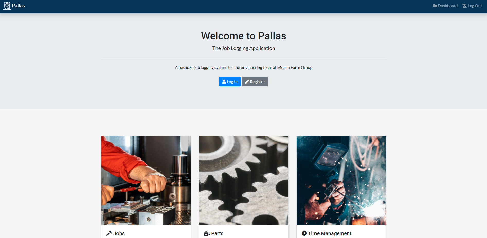

## [Deployed Site](https://meade-pallas.herokuapp.com/)

## Contents

1. [Project Overview](#project-overview)
2. [Project Inception](#project-inception)
3. [UX](#ux)
4. [Features](#features)
5. [Technologies](#technologies)
6. [Testing](#testing)
7. [Running Locally](#running-locally)
8. [Deployment](#deployment)
9. [Project Outcome](#project-outcome)
10. [Credits](#credits)

## Project Overview

*Pallas* is a bespoke web based application, designed for Meade Farm Group, that allows the maintenance team and their managers to record and maintain stock records and job records. The project uses *Django*, *PostgresQL* and *Heroku*. The project was requested by the maintenance team who required an easy to use, mobile, responsive application for recording and maintaining stock and job records.

Meade Farm Group is a fresh goods processor based in the Republic of Ireland, servicing the retail food sector, supplying fresh goods to the likes of Lidl and Aldi, amongst others. The maintenance/engineering teams at the company are involved in the general maintenance of all the machines in the factory, utilities in the offices and developing new areas and projects. Due to this wide range of responsibilities and the often *ad-hoc* nature of their work an app was required that allowed the team to record and maintain records of their work quickly and easily while on the job as well as being intuitive, giving users notifications of outstanding jobs to be done.

Recording and maintaining stock records and job records and analayzing the trends and resources being used by different departments was key to management too to be able to make informed decisions.

## UX

### Project Goals

The goal of this project is to create an application that allows maintenance/engineering users to record and maintain job records as well as stock records. The interface should be quick and easy to use, bearing in mind that the users often will need to record information on the application while on the job. The stock system should allow stock to be received in, transferred to a user, and assigned to a job. It should also allow. All jobs and stock movements should be assigned to a department/product line so that reports can be build to analyze the resources being spent used by the different departments/product lines. The UI should be simple, easy to use and navigate, and feature unique functionalities depending on the user that is logged in *(Admin, Manager, General Operative, etc.)* The app should also communicate effectively with the users, informing them when they've been assigned a job/have outstanding tasks via notifications when on mobile.

### User Goals

* Record time against jobs
* Stock management
* Allocate resources to jobs
* View outstanding jobs
* View reports about resources being consumed
* Easy to use UI when working
* Notifications system that informs users of new jobs that have been assigned

### User Stories

* As a maintenance engineer, I need to be able to easily view my outstanding jobs while on the production floor. I also need to be able to quickly create and record time against jobs. I also need to be able to create unscheduled *ad hoc* jobs. I also want to be notified of any new jobs that are assigned to me.
* As a maintenance manager, I need to be able to create jobs and assign them to users. I also need jobs to be automatically generated for different assets at specified time intervals. I also need to be able to view breakdowns detailing resources used by different departments/product lines. I also want to be able to assign priorities to jobs.
* As a stock controller, I need to be able to accurately maintain stock records. I need to be able to receive stock in and then assign it to users who can then assign it to jobs. I'd also like to be notified when stock quantities fall below a certain threshold. I'd also like to be able to assign items barcodes to help manage stock.
* As a commercial buyer, I need to be able to see reports detailing how much resources/time is being consumed by my product lines so that I can make informed decisions about the viability of the products.

### Site Owner Goals

* As a site owner, I want the mobile controls for users to be minimal, simple and easy to use for engineers trying to record jobs on the go.
* As a site owner, I need to have a robust permissions system to account for different user types who should have access to different sections.
* As a site owner, I need to build a robust relataional database structure that allows for easy expansion and changes.

### User Requirements and Expectations

#### Requirements

* Create and record time/resources against jobs
* Jobs page where they can see tasks that have been assigned to them
* Stock management system
* Allow assignment of stock/time resources to departments
* Notifications system to inform users of outstanding jobs that need to be done, new requests, stock alerts
* Reports where managers can view resources/time being consumed by different departments/product lines
* Asset management system where assets *(machines, equipment)* can be recorded and maintained
* Barcoding system for parts
* Easy search functionality when searching for parts
* View asset history, maintenance job records
* PPM - Scheduling of PPMs for assets
* Projects system - Jobs Assigned to Project

#### Expectations

* Consistent styling across site
* Easy to use, formal/professional UI

### Design Choices

Given the application's purpose, I needed the UI of the application to be simple, clear, easy to navigate and minimalistic so as not to distract a user trying to complete tasks on the app while working. I decided to use [Bootstrap v4.6](https://getbootstrap.com/docs/4.6/getting-started/introduction/) as a starting place given it's wide range of built-in functionality.

#### Colours

For colours, I wanted the site to be consistent across the site with a standard colour pallette to make user interactions clear and easy. I used [Coolors](https://coolors.co/) to help with that. I settled on a two blue shades for the navigation and header elements of the site, along with black and white white colours for the main fields and body elements as well as text.


#### Fonts

I wanted the fonts to be professional, clearly legible and formal. For this, I decided on Lato Regular 400 for the main element text and Roboto Bold 500 for the headings and navigation.

I used [Google Fonts](fonts.google.com) to source these fonts.

### Wireframing

For wireframing, I used [Balsamiq](https://balsamiq.com/). I spent a lot of time thinking about and looking for inspiration for layout designs that would suit the application. Given the use of the app, I wanted the navigation to be easy to use, but at the same time there was a lot of functionality and forms that the user could need to get to so I needed that to work too.

I eventually decided on a dashboard layout where navigation headings would be at the top of the main elements and the sub navigation within that heading to the side.

#### Dashboard


The dashboard view is the view a user sees when they initially log into the app. It consists of a different stats and charts that display key metrics about the state of affairs regarding jobs, people and projects.

The top bar consists of the app name, and the user name where they can click to log out. It also has a notification icon which shows the user how many unread notifications they have.

Beneath that, on desktop the users can navigate to the different main sections of the site, the links appear differently depending on the user type *(Admin/Manager/Stock Person/General Operative)*

The side navigation, on desktop shows the sub navigations for that section. For the dashboard this means they can go to the home screen, the screen they are on or view reports about various things.

These navigation elements wrap on mobile views to a dropdown menu with the subheadings as a dropdown menu.

The main section of the site features the off white colour for the background of the site and the different elements for the section featured in tabs with the dark blue colour for the heading of the tab.

#### Jobs - Home

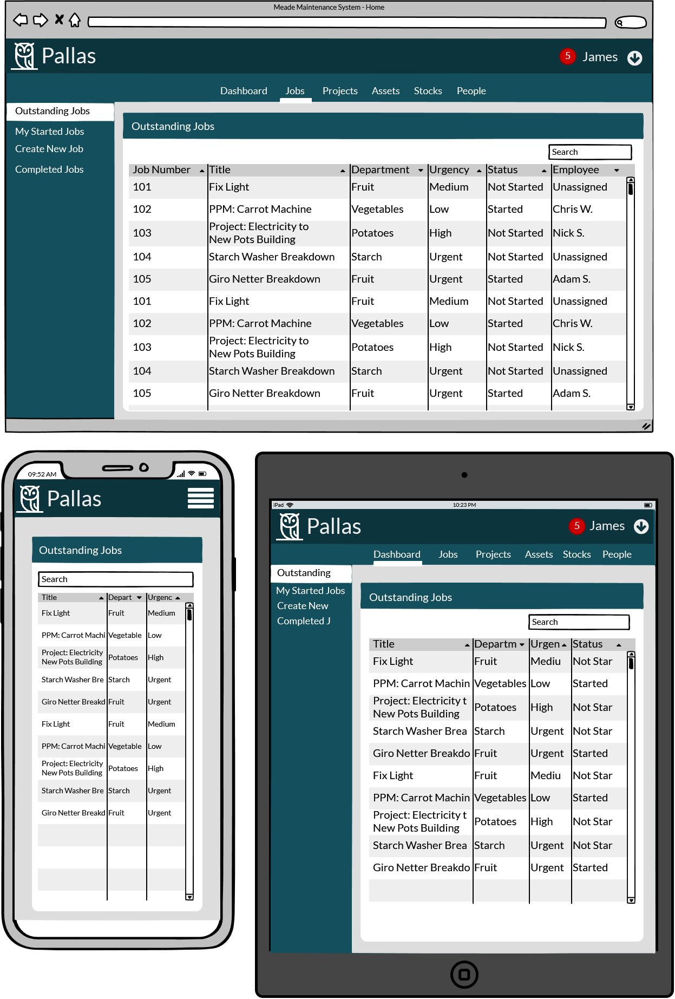

The Jobs - Home page shows the user their outstanding jobs in a table format with key details. They can click on the rows to view the job. There is also a search bar where the user can search for something in the table.

Some of the columns are removed on mobile views to fit screen width.

#### Job - Detail


The job detail views shows details of the job in the first tab as well as attachments, the steps needed to complete the job in the second tab, the parts that have been added to the job in the third tab. The equipment needed for the job in the fourth section and the time that has been logged for the job in the fifth section.

Beneath this are operations the user can perform for the job such as editing the details of the job, starting/stopping the job, logging time against the job, marking it complete, adding parts to the job or canceling the job.

#### Job - Create


The job create view allows the user to create a job. The top section allows the user to add the details for the job, the second section allows the user to attach files such as a user manual or picture to the job. The third section allows the user to add the steps required to complete the job, it also allows them to adjust the ordering of the steps to complete the job. The third section allows the user to specify the equipment needed to complete the job.

#### Notificaitons

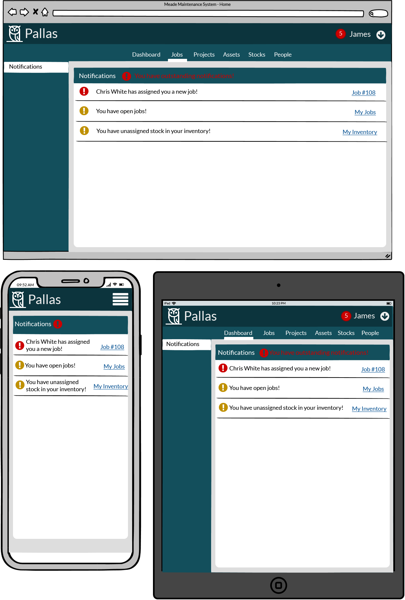

The notifications view shows the user notifications in a table view as well as providing a link to whatever it is requires their attention.

#### Employee/Profile Page


The profile page allows users to view their profile with their employee details as well as their statistics.

If a manager is logged in, they can generate an employee report or use the *Give Bonus* button to award an employee a bonus.

#### More Wireframes

The rest of the wireframes follow a similar styling pattern and so I will not show them all here. You can view the rest of the wireframes [here](wireframes/Wireframes.pdf).

### Data Structure

This project required the use of a relational database which made a lot of sense for this project given the many different models and relationships between models required.

I decided when designing the project to create a graphical representation of the database structure and relationships to help visualize and think about the data structure. I used [diagrams.net](https://app.diagrams.net/) to do this.

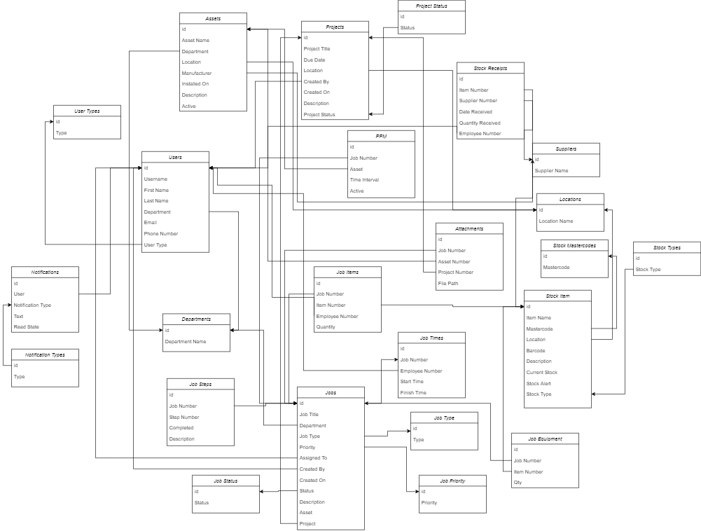

#### Users Model


For the users model, I needed the user to have a username to login with, first and last names, an email address, phone number as well as a *department* and *user type*.

The *department* links to the *departments* table in a one-to-many relationship and represents which department of the company the user belongs to. The *user type* field links to the *user types* table and represents the type of user it is, *Admin, General Operative, Manager* or *other*.

#### Jobs Model

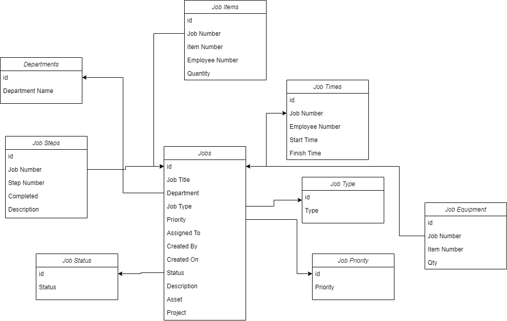

The *Jobs* model links to a lot of different models because it is so integral to application. The *Job Type* links to the links to the *Job Type* model, the *Department* links to the *Department* model and so on. All these relationships are one-to-many jobs. The *Jobs* model also has optional foreign key fields for *Assets* and *Project* if the job is attached to a particular one.

The *Job Items* model is essentially a many-to-many relationship between the *Jobs* and *Items* models with the additional fields of *Employee Number* and *Quantity*.

#### Projects Model

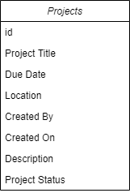

*Projects*, from the application's point of view, is simply a collection of jobs with a project information attached to it. The project model has a one *Project* to many *Jobs* relationship. It also has a *Location* relationship to the *Locaitons* model as well as a *Project Status* link to the *Project Status* model.

#### Assets Model

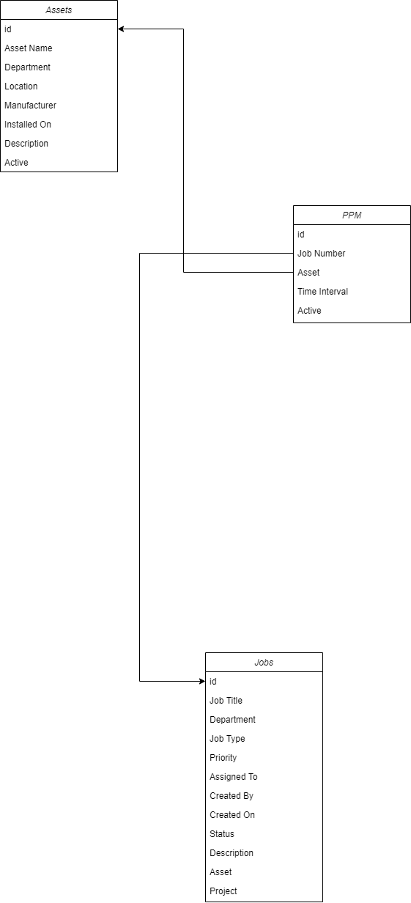

An asset is a particular machine or piece of equipment that requires on-going, regular maintenance. This is facilated through the *PPM* model *(Planned Preventative Maintenance)* where jobs are selected that repeat themselves, i.e. duplicate/copy themselves, at a specified time interval to be performed again. Records of these jobs being completed are required for food safety audit compliance and automating the scheduling of these jobs made a lot of sense.

#### Items Model

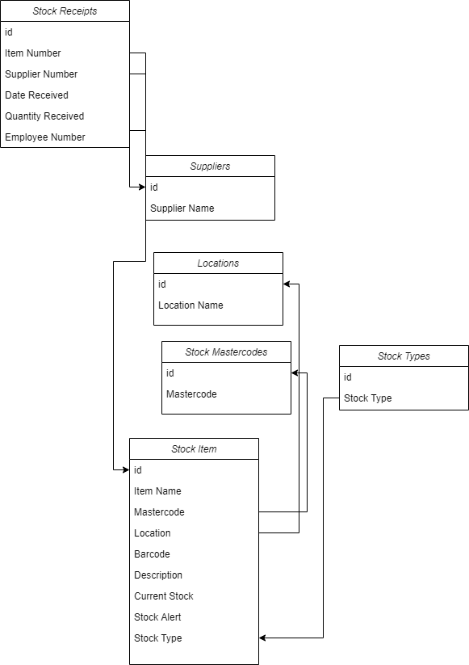

*Items* are stockable consummables or items that are used in jobs like screws, bearings, motors, cables etc. *Items* have a *Mastercode* or master tag that signifies which master group they belong to, 12 inch screws have a *mastercode* of *screws*, *100mm bearings* have a *mastercode* of *bearings* etc. This is necessary to help categorize different items that are similar but slightly different dimensions or manufacturer etc. *Stock Type* represents whether the product is consummable or equipment that can be resused. *Stock Receipts* stores a history of the receipt of items in to stock. *Locations* signify where an item is located.

## Application Logic

In this section, I am going to explain a bit about the application that may not be immediately evident to a non-Meade Farm user.

### Users

A user is a Meade Farm employee who has to log jobs through the application. As explained earlier, users have a user type or clearance level which determines their level of access in the application.

Admin users have access to all areas of the site and can perform any action. Managers similarly can access all areas of the site except the django admin panel. Stock Controllers have similar access as Managers but cannot view reports or individual employee profiles, other than their own. General operatives can create, edit and delete jobs but only if they created them or were assigned to them. They can also view and add stock to jobs but cannot receive stock or move stock around. Requesters can request a job be performed via a form but nothing else.

### Jobs

A job is a task to be undertaken by a user. Jobs can be requested by Requesters, which then must be approved by the respective department Manager. Jobs can also be created by managers and assigned to users or created by general operatives.

When a job is assigned to a user it is assigned the status of *Not Started*, when a user first logs time agains a job the job's status changes to *Started*, when a user is satisfied that the job is complete they can go in to the job and mark it as *Completed*.

Multiple users can be assigned and work on a single job. As such the relationship between the *Assigned To* field in the *Jobs* model and the *Users* model is a *Many-To-Many* relationship.

### Projects

From a real-world point of view, a *project* is a large task/undertaking/development that is multi-staged and requires work over several weeks/months. From a logical point of view, *projects* are just collections of jobs with a common heading.

### Assets

Similar to projects, *assets* are collections of jobs with a common heading, in this case the *asset*. This is typically a large machine that requires on-going maintenance. Unlike projects though, *assets* require ongoing maintenance through *PPM*s and records of these being done at regular intervals is required by food safety auditors. As such, jobs need to be automatically duplicated at set intervals so that users are notified that the task needs to be repeated.

### Stock Items

*Stock Items* or *Items* are stockable items that can be consumed by jobs. These can include, screws, bearings, cables, motors and so on.

### Authentication

The application requires a user to login to use the application features.

Certain functionalities are locked to different user types to prevent users seeing or performing actions that they shouldn't be. In the register form users must select a *User Type*. *Admin* and *Manager* users have access to all areas and can create, edit and view all areas of the site. These include the *People* and *Stocks* apps, use the Employee Bonus form with *Stripe* integration. They can also assign jobs to people, which *General Operative* users cannot do.

*Stock Controllers* can perform all functions, including receiving and creating stock items, but cannot view the *People* app or staff details or assign jobs to other users.

*General Operative* users can perform most functions except for the ones mentioned above.

**Note:** *Admin* user types are **not** the same as a Django superuser. Registering for an account with an *Admin* user type will not work for the Django admin panel.

## Stripe Integration

A payment processing functionality was not a feature that was required for this project but it was a requirement for demonstration purposes. The *Stripe* API is hooked up to the application through the *User Bonus* form. This can only be accessed through the *People* link and in the main nav, clicking on a user, and going to the bottom of the user profile and clicking the *Give Employee Bonus* button. To be clear, the application does not store employee account details, in this theoretical use case, all money would go to the same stripe account, which doesn't make sense if the idea is to give the bonus to the selected employee. But the functionality is purely for demonstration purposes is not a core feature or functionality and will be removed for the live production deployment of the application.

## Development Process

### Kanban Board

I used a GitHub project board to help me track tasks that needed to be done for the project. You can find this project board [here](https://github.com/Summersby95/meade-maintenance-app/projects/1). I found it very useful in keeping track of my tasks.

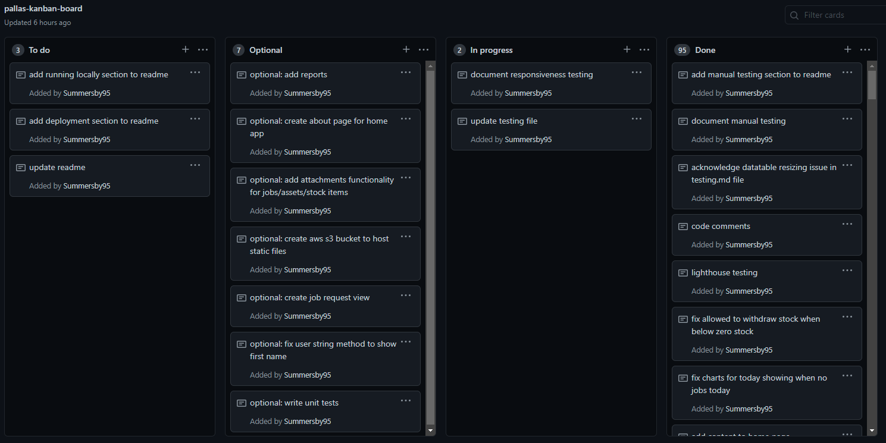

### VS Code

I used Visual Studio Code as my editor of choice. I used the [virtualenv](https://virtualenv.pypa.io/en/latest/) python package to create a virtual environment in the project folder where I installed all my required python packages. This was very useful and helped contain my project packages to the project.

### GitHub

GitHub was used for source control. I committed regularly and in small descriptive chunks using key words like *feat* and *fix* as prefixes for the commits to help the reader understand them easier.

## Features

### Existing Features

* Job logging functionality
* Time logging for jobs
* Notifications system
* Dashboard with metrics and charts
* Registration/Log In/User Authentication with verification emails
* Project tracking functionality
* Asset tracking functionality
* Stock management system
* Employee reports
* Employee bonus reward using *Stripe*
* Responsive design
* Easy to use navigation
* Datatables to easily search and find things

### Future Potential Features

* Attachments - Give users the ability to attach photos, pdf manuals, standard operating procedures for jobs, assets, projects and so on.
* Barcode Scanning - Give users the ability to scan barcodes of assets/stock items to withdraw them/find them.
* Unit Tests - I would have liked to write unit tests for all the different functionalities of the site, however I simply ran out of time to implement these.
* Better Stock Locations For Warehouse - More in depth location tracking, perhaps with a second stocks locaiton model to help manage stock better
* Better Job Priority Notifications/Management - Alert users more effectively of high and urgent priority jobs they've been assigned
* Phone Push Notifications - Send notifications to devices so that users don't have to log in to see their notifications
* Reports - Create detailed reports for different areas like jobs/projects/assets to give detailed statistics of resources being used with specific style rules to make them print friendly
* Better User Time Management - Create a more visually effective way to show a user their time log breakdowns to see where they've logged time for the day and where they havent

## Technologies Used

### Languages

* HTML5
* CSS3
* JavaScript
* Python 3.9
* SQL

### Frameworks/Libraries/Tools

* [Django](https://www.djangoproject.com/)
* [Heroku](https://www.heroku.com/)
* [PostgreSQL](https://www.postgresql.org/)
* [Git](https://git-scm.com/)
* [GitHub](https://github.com/)
* [Bootstrap v4.6](https://getbootstrap.com/)
* [jQuery](https://jquery.com/)
* [Balsamiq](https://balsamiq.com/)
* [Diagrams.net](https://app.diagrams.net/)
* [Chart.js](https://www.chartjs.org/)
* [Datatables](https://datatables.net/)
* [Stripe](https://stripe.com/en-ie)

## Testing

For testing information regarding this project please see the [TESTING.md](TESTING.md) file.

## Running Locally

**Note:** There is an issue with the migrations for the project that seems to prevent the initial migrations for the app running correctly. The database runs fine for the application, but attempting to clone the repo and running the initial migrations will fail. I have attempted to find a fix to this, however I haven't been able to find one yet and I am out of time to find one. The following steps will work up until step 10, when I apply a fix the rest will work.

To run this project locally, follow the following steps. The follwing steps assume you already have [Python 3.9.x](https://www.python.org/) and [pip](https://pypi.org/project/pip/) installed on your computer.

1. Open your text editor of choice, in my case, I'm using Visual Studio Code
2. Find the *Clone Git Repository* option in your text editor window.
3. Once clicked, paste the following link in the field that appears: [Repo Link](https://github.com/Summersby95/meade-maintenance-app.git)
4. Select a folder on your computer to store the cloned repository
5. Once cloned, open the folder in your editor.

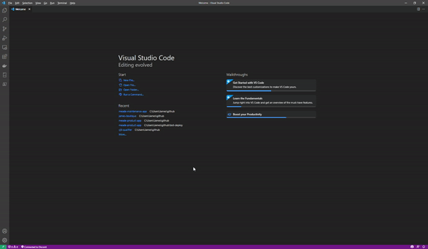

* Once done, open a terminal in the project window and run the following command

```python
# Command 1
pip install virtualenv
# Command 2
virtualenv venv
```

* After running these commands, find the option in your editor to *Select Python Interpreter*
* In the dropdown list, wait a few seconds, refresh the list and select the *venv* virtual environment.

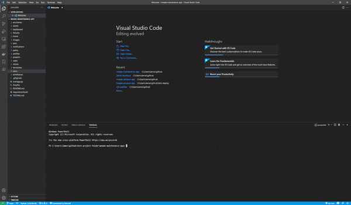

* Once done, open a new terminal window and run the following command.

```python
pip install -r requirements.txt
```

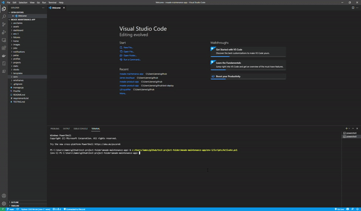

* Run the following command

```python
python manage.py migrate
```

* Create an ```env.py``` file in the base directory of the project and add the following, replacing the placholder text with your own values

```python
import os

os.environ.setdefault("STRIPE_SECRET_KEY", "sk_test_secret_key")
os.environ.setdefault("SECRET_KEY", 'django-insecure-secret-key')
os.environ.setdefault("DEVELOPMENT", "True")
```

* Next run the following command and create a superuser account

```python
python manage.py createsuperuser
```

* Finally, start the server using the following command and navigate to ```localhost:8000``` to see it in action.

```python
py manage.py runserver
```

## Deployment

TBC

## Project Outcome

TBC

## Credits

### Useful Links

* [Bootstrap - Dashboard Example](https://getbootstrap.com/docs/4.0/examples/dashboard/)
* [Crispy Forms](https://django-crispy-forms.readthedocs.io/en/latest/index.html)
* [Django - Authentication](https://docs.djangoproject.com/en/3.2/topics/auth/default/)
* [Django - Make Form Field Readonly](https://stackoverflow.com/questions/324477/in-a-django-form-how-do-i-make-a-field-readonly-or-disabled-so-that-it-cannot)
* [Django - Pass User Object To Form](https://stackoverflow.com/questions/43347566/how-to-pass-user-object-to-forms-in-django)
* [Django - m2m_changed Signal](https://docs.djangoproject.com/en/3.2/ref/signals/#m2m-changed)
* [Chart.js - Doughnut Charts](https://www.chartjs.org/docs/latest/charts/doughnut.html)
