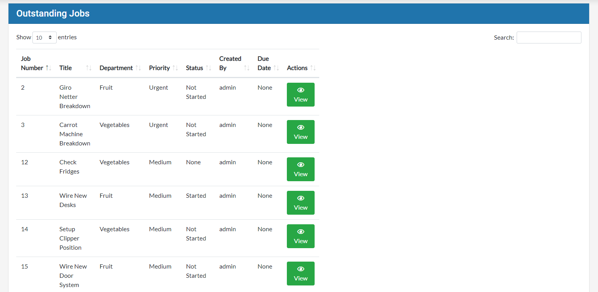

# Testing

## Bugs Found

1. **Profile Element Being Pushed To Left On Large Screens** - *Fix:* Testing showed that the *navbar-expand-lg* bootstrap class was changing the navbar elements to flex on large screens which messed up the profile position. Removing the class fixed the issue.
2. **DataTables Not Resizing Correctly** - *Fix:* Remove *class="col"* attributes from *th* elements in datatables.
3. **Cards Stacking On Top Due To Height Constraint** - *Fix:* Add margin bottom and use calc function to calculate height instead.
4. **Steps Up and Down Buttons Not Behaving Properly On Row Delete** - *Fix:* TBC
5. **Steps Up and Down Buttons Not Being Disabled On Edit Page** - *Fix:* This was due to the fact that the rows were generated by django, not the js script so the script to disable the appropriate buttons wasn't running. I created a document ready function that performed the action again.
6. **Some Users Not Able to Create Jobs** - *Fix:* TBC
7. **Extending User Model To Include Custom Fields Not Saving Correctly** - *Fix:* Create custom save method on the custom all-auth signup form to process fields and create an instance of the *UserProfile* model
8. **Circular Import In Assets Models File Due To Interdependancy of Models** - *Fix:* The *Job* model has a foreign key to the *Assets* model, the *PPM* model has a foreign key relationship to the *Assets* and *Jobs* models. Having the *Assets* model and *PPM* models in the same *models.py* file was giving a circular import due to the relationships between the models. As such I had to segregate the models into two seperate files in the *submodels* directory to prevent the circular import error.
9. **Tables overflowing horizontally in details pages on mobile views** - *Fix:* Add *table-responsive-sm* class to tables
10. **Not Able To Accurately Record Which Jobs Are PPM's** - *Fix:* Change PPM model structure to be a job template.
11. **Repetitive Templating** - *Fix:* Create base templates for different template structures
12. **Unnecessary POST Handlers** - *Fix:* Some views call an instance of a form just to set an initial parameter but get passed to a different view as the POST form handler, as such, having POST handlers on the initial views was unneccessary
13. **No Margin Beneath Buttons On Details Pages** - *Fix:* Add bottom padding to main element
14. **Allowed To Withdraw Stock When Not Enough Available** - *Fix:* Add custom clean method to transfers form to check the current stock before validating the form.
15. **int object has no attribute microseconds** - *Fix:* When creating a new project I ran an error that was trying to get the attribute microseconds of an integer. I discovered that in one of my aggregate functions, I was trying to find the average time. If no times are recorded then it is treated as zero. I then wanted to take the microseconds attribute off the average time which is what caused the error. I added a check to see if the average time was a time delta object before the operation is performed.

## Outstanding Bugs

### Datatables Not Resizing Correctly On Screen Resize

[Datatables](https://datatables.net/) is a JS/CSS api for creating datatables with responsive resizing, search functionalities, ordering buttons, pagination and many other features. It is an excellent library. However, a bug I found when using it was that the datatable underwent a large screen resize, the responsiveness of the datatables would break and cause the table to overflow out of it's divider or not fill it's container completely. Upon refreshing the page at the current screen width, the datatables behave as expected. You can see examples of what I mean below.

#### Normal Behaviour

#### Not Filling Div On Screen Resize - Small To Big

#### Overflowing Div On Screen Resize - Big To Small

I struggled to find a solution to fix this problem. Adding CSS style rules to the table/container accomplished nothing as the *Datatables* library overrides them. I scoured the datatables documentation for fixes but came up empty. I tried the following datatables functions, [responsive.recalc()](https://datatables.net/reference/api/responsive.recalc()) and [columns.adjust()](https://datatables.net/reference/api/columns.adjust()) but neither of them fixed the problem.

One thing that did work was using a JS script to automatically refresh the page on screen resize however after discussing this fix with my mentor he suggested removing this as it was bad UX design to force a page reload on a screen resize. We worked together to try and find a solution to the issue but came up short and decided that screen resizes are not natural browser behaviours and that as long as it was responsive on mobile and desktop when the page is initially loaded then it is responsive. I agreed and removed it and decided instead to document the bug in the documentation as proof of my attempts to fix the issue.

To be clear, the tables are responsive on all screen sizes and the tables resize correctly on small resizes, mobile portrait to mobile landscape for example, however on some large screen resizes the datatables may not behave properly by either not filling their div or overflowing it. This can be amended by a page reload.
